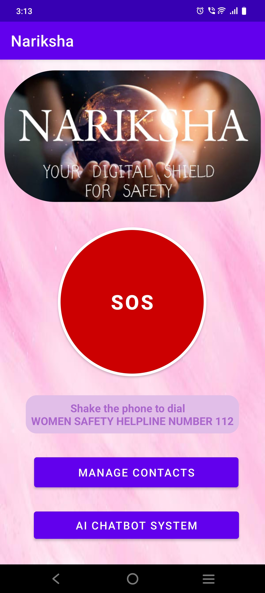
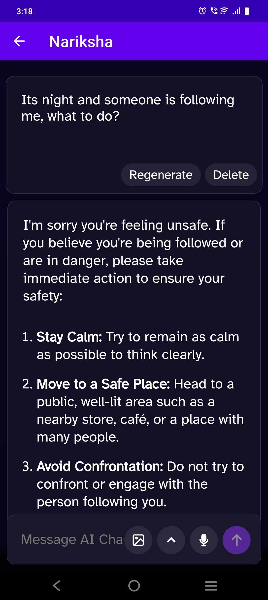
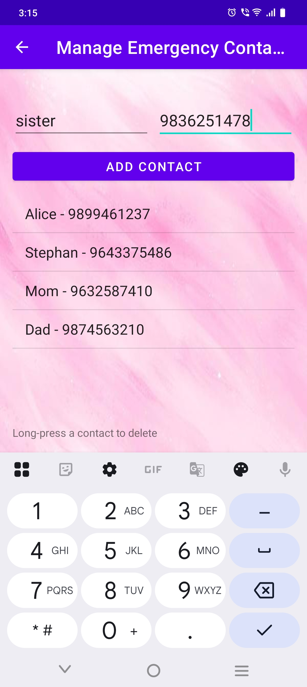
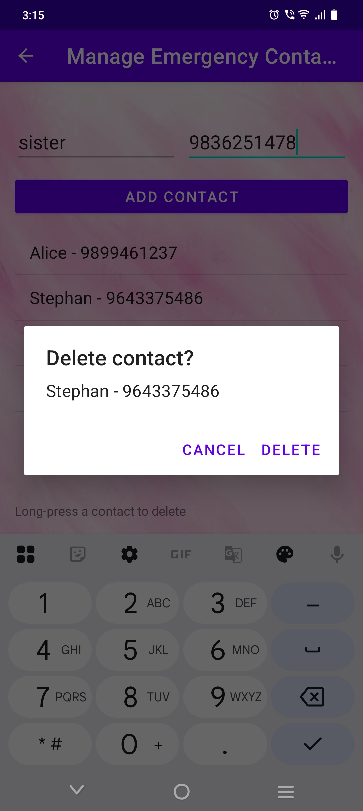
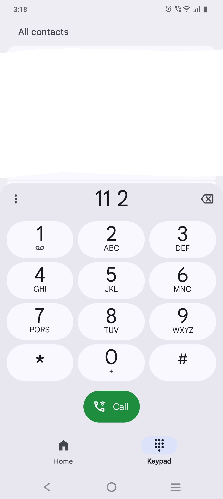

📱 Nariksha – Women Safety Android App

Nariksha is an Android application built to enhance women’s safety by providing features such as an SOS button, emergency contact management, and an integrated chatbot.

🚀 Features

SOS Button – Quickly send alerts in case of emergencies.

Chatbot – Basic chatbot interface for interaction.

Manage Contacts – Add, update, and delete emergency contacts.

User-Friendly UI – Simple layouts and clean navigation.

📂 Project Structure
app
├── manifests
│   └── AndroidManifest.xml
│
├── java
│   └── com.example.nariksha
│       ├── ui
│       │   ├── ChatbotActivity
│       │   ├── Contact
│       │   ├── ContactsDBHelper
│       │   ├── MainActivity
│       │   └── ManageContactsActivity
│       │
│       ├── com.example.nariksha (androidTest)
│       └── com.example.nariksha (test)
│
├── res
│   ├── drawable        # Images & drawable resources
│   ├── layout          # XML layouts for activities/fragments
│   ├── menu            # App menus
│   ├── mipmap          # App icons
│   ├── navigation      # Navigation graphs
│   ├── values          # Strings, colors, styles, themes
│   └── xml             # Additional XML configs
│
└── Gradle Scripts
    ├── build.gradle.kts (Project level)
    ├── build.gradle.kts (App module level)
    ├── proguard-rules.pro
    ├── gradle.properties
    ├── settings.gradle.kts

🛠️ Tech Stack

Language: Java + Kotlin DSL for Gradle

IDE: Android Studio

Build System: Gradle (KTS)

Database: SQLite (via ContactsDBHelper)

📸 Screenshots (Optional)

👉 You can add screenshots of your app UI here.

📦 APK Download

The latest release APK is available in the repository:
➡️ Nariksha_APK.apk

🤝 Contributing

Contributions are welcome! Feel free to fork this repo and submit pull requests.

📄 License

This project is licensed under the MIT License – see the LICENSE
 file for details.

 ## 📸 Screenshots

### 🏠 Home Page

### 🤖 AI Chatbot

### 📞 Emergency Contacts

### 🚨 SOS Message

### ❌ Delete Contact

### 📳 112 Dial Triggered by Shaking

